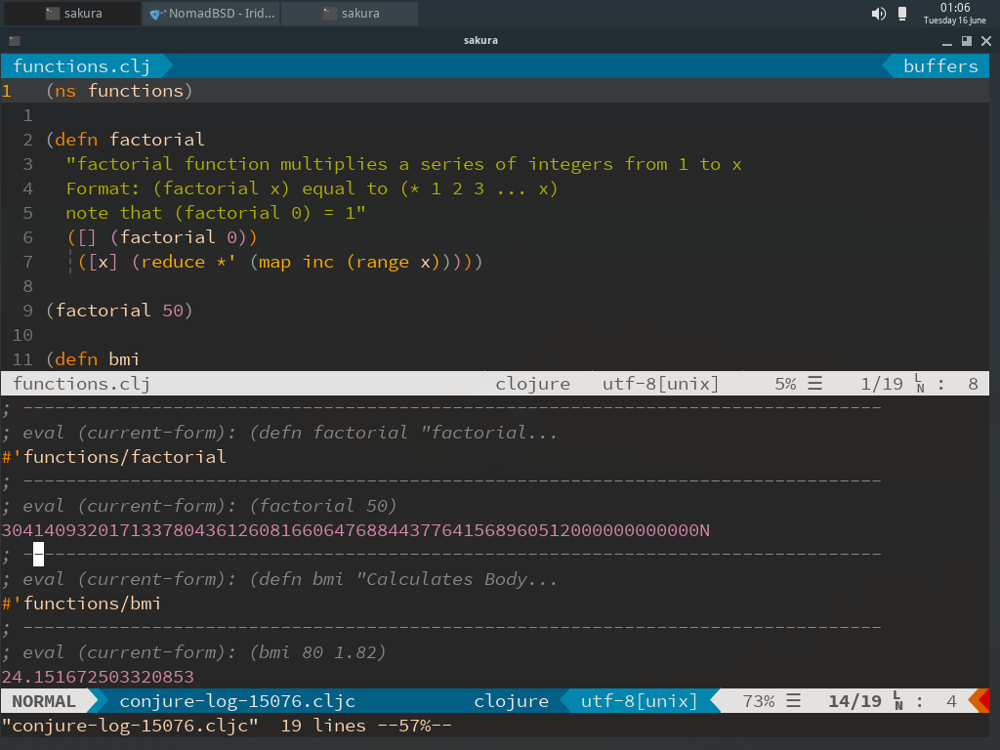

# Set up Clojure development in Neovim
## On a fresh [NomadBSD](https://nomadbsd.org) installation. Should also apply to other FreeBSDs.

[NomadBSD](https://nomadbsd.org) is a FreeBSD release running on the Openbox window manager.
It is designed to run on a USB stick, but here I am personally running it in a virtual machine in [VirtualBox](https://www.virtualbox.org).

Here are the steps that I took (after a bit of trial and error), to install a Clojure development environment using Neovim.

I was inspired by an article on Oliver Caldwell's blog [Getting started with Clojure, Neovim and Conjure in minutes](https://oli.me.uk/getting-started-with-clojure-neovim-and-conjure-in-minutes/).

I have added some other features:

- [x] [Airline](https://github.com/vim-airline/vim-airline) status bar
- [x] [Rainbow Parentheses](https://github.com/junegunn/rainbow_parentheses.vim)
- [x] [Gruvbox](https://github.com/morhetz/gruvbox) or [Tender](https://github.com/jacoborus/tender.vim) Colour schemes
- [x] Some C/C++ and Python support (optional)
- [x] [Nerdtree](https://github.com/preservim/nerdtree) file browser

Things to add in the future (as I learn more of FreeBSD and Neovim)

- [ ] Nodejs which does not uninstall Firefox
- [ ] Easymotion
- [ ] Vim-sexp
- [ ] Vim-clap
- [ ] migrate to [Conquer of Completion (coc.nvim)](https://github.com/neoclide/coc.nvim)

On to the installation ...
## Update FreeBSD
```sh
sudo freebsd-update fetch
sudo freebsd-update install

sudo pkg update
sudo pkg upgrade
```
### Install Clojure Binaries
```sh
sudo pkg install leiningen clojure rlwrap wget
```
### Java OpenJDK 8 post-install message
=====
Message from openjdk8-8.242.07.1:

--
This OpenJDK implementation requires fdescfs(5) mounted on /dev/fd and
procfs(5) mounted on /proc.

If you have not done it yet, please do the following:

	mount -t fdescfs fdesc /dev/fd
	mount -t procfs proc /proc

To make it permanent, you need the following lines in /etc/fstab:

	fdesc	/dev/fd		fdescfs		rw	0	0
	proc	/proc		procfs		rw	0	0
```sh
# thus
sudo mount -t fdescfs fdesc /dev/fd # enables now
sudo echo 'fdesc  /dev/fd    fdescfs    rw 0 0' >> /etc/fstab # enables at boot
```
### Installing Joker from source
Joker is a small implementation of Clojure, written in Go.
There are no binaries for FreeBSD, thus will have to install from source.
Install latest version if different from below.
```sh
cd ~/Downloads
wget https://github.com/candid82/joker/archive/v0.15.5.tar.gz
tar xvf v0.15.5.tar.gz
```
### Install [Go Language](https://www.golang.org/dl)
Download and extract go binaries (current version 1.14.4 at time of writing)
```sh
wget https://dl.google.com/go/go1.14.4.freebsd-amd64.tar.gz
sudo tar -C /usr/local -xzf go1.14.4.freebsd-amd64.tar.gz
```
Add /usr/local/go/bin to PATH (either with command below,
or manual editing of ~/.profile)
```sh
echo 'export PATH=$PATH:/usr/local/go/bin' >> ~/.profile
source ~/.profile
```
### Compile Joker binary
```sh
cd joker<press TAB>
./build.sh
sudo cp joker /usr/local/bin
```
### Install clj-kondo
No FreeBSD binaries exist, but can install via yarn
```sh
# N.B. automatically uninstalls firefox
sudo pkg install node12 yarn-node12
sudo yarn global add clj-kondo # installed in /usr/local/bin
```
### Install another browser
I chose Iridium Browser, a privacy-focused clone of Chromium.
```sh
sudo pkg install iridium-browser
```
## Install Neovim and helpers
```sh
sudo pkg install neovim python37
sudo pkg install ccls uncrustify # only if you want C/C++ linting and formatting
python3.7 -m pip install --user pynvim yapf flake8 # for python linting and formatting
# TODO - find out how to add pip binaries to PATH.
yarn global add neovim # for neovim's nodejs internal use (would be needed for future coc.nvim)
mkdir -p ~/.config/nvim
```

### Install vim-plug
```sh
sh -c 'curl -fLo "${XDG_DATA_HOME:-$HOME/.local/share}"/nvim/site/autoload/plug.vim --create-dirs \
       https://raw.githubusercontent.com/junegunn/vim-plug/master/plug.vim'
```

### Install init.vim
### Copy and paste into ~/.config/nvim/init.vim
```vim
" Specify a directory for plugins.
call plug#begin(stdpath('data') . '/plugged')

" Specify your required plugins here.
Plug 'liuchengxu/vim-better-default'

" Autocomplete
Plug 'Shougo/deoplete.nvim', { 'do': ':UpdateRemotePlugins' }
Plug 'ncm2/float-preview.nvim'
Plug 'Shougo/deoplete-clangx'

"Python support
Plug 'davidhalter/jedi-vim'
Plug 'deoplete-plugins/deoplete-jedi'

"Auto-pairs "" '' `` [] () {}
Plug 'jiangmiao/auto-pairs'

" Asynchronous Linter
Plug 'w0rp/ale'

"Conjure
Plug 'Olical/conjure', { 'tag': 'v3.4.0'}

"Rainbow Parentheses
Plug 'junegunn/rainbow_parentheses.vim'

" Vim airline status bar
Plug 'vim-airline/vim-airline'
Plug 'vim-airline/vim-airline-themes'

" Better language packs
Plug 'sheerun/vim-polyglot'

" Display indentation lines
Plug 'Yggdroot/indentLine'

" NerdTree
Plug 'scrooloose/nerdtree'

" Gruvbox theme
Plug 'morhetz/gruvbox'

" Tender theme
Plug 'jacoborus/tender.vim'

call plug#end()

" Place configuration AFTER `call plug#end()`!

let g:deoplete#enable_at_startup = 1
call deoplete#custom#option('keyword_patterns', {'clojure': '[\w!$%&*+/:<=>?@\^_~\-\.#]*'})
" Change clang binary path
call deoplete#custom#var('clangx', 'clang_binary', '/usr/bin/clang')
set completeopt-=preview

let g:float_preview#docked = 0
let g:float_preview#max_width = 80
let g:float_preview#max_height = 40

let g:ale_linters = {
      \ 'clojure': ['clj-kondo', 'joker']
      \}

" rainbow parentheses
" Activation based on file type
augroup rainbows
  autocmd!
  autocmd FileType lisp,clojure,scheme,json,r,c,cpp,javascript RainbowParentheses
augroup END

let g:rainbow#max_level = 16
let g:rainbow#pairs = [['(', ')'], ['[', ']'], ['{', '}']]

"Airline
let g:airline_powerline_fonts = 1
let g:airline_theme = 'papercolor'
let g:airline#extensions#whitespace#enabled = 0

"Enable the list of buffers
let g:airline#extensions#tabline#enabled = 1

"Show just the filename
let g:airline#extensions#tabline#fnamemod = ':t'

" ALE to display warnings in airline
let g:airline#extensions#ale#enabled = 1

" Change mapleader to comma ','
let mapleader = ','

" Change local leader key to '\'
let localmapleader = '\\'

" NerdTree Settings

" <Ctrl-n> to activate Nerdtree
map <C-n> :NERDTreeToggle<CR>

" Close nvim if Nerdtree is the only window open
autocmd bufenter * if (winnr("$") == 1 && exists("b:NERDTree") && b:NERDTree.isTabTree()) | q | endif

" Define Nerdtree arrows
let g:NERDTreeDirArrowExpandable = '▸' " unicode character U+25B8 'black right-pointing small triangle'
let g:NERDTreeDirArrowCollapsible = '▾' " unicode U+25BE 'black down-pointing small triangle'

" Indent line Character
let g:indentLine_char = '┆' " unicode U+2506 'box drawings light triple dash vertical'

" Python3 program location
let g:python3_host_prog='/usr/local/bin/python3.7'

" Asynchronous Linting Engine (ALE)
" leader+l = manual ALE linting
nnoremap <leader>l :ALELint<CR>
"
"Configure ALE to jump between linting errors:
" [c - to previous error
" ]c - to next error
nmap <silent> [c <Plug>(ale_previous_wrap)
nmap <silent> ]c <Plug>(ale_next_wrap)
"
" Change ALE warning signs
let g:ale_sign_error = '✘' " unicode U+2718 'Heavy Ballot X'
let g:ale_sign_warning = '⚠' " unicode U+26A0 'Warning Sign'
"
let g:ale_lint_on_text_changed = 'never'
let g:ale_lint_on_insert_leave = 1
let g:ale_linters = {
\   'clojure': ['clj-kondo', 'joker']
\}

" install yapf, flake8, clang-tools
let g:ale_fixers = {
\   '*': ['remove_trailing_lines', 'trim_whitespace'],
\   'python': ['yapf', 'flake8'],
\   'c': ['ccls', 'uncrustify'],
\   'cpp': ['ccls', 'uncrustify']
\}

" Gruvbox
let g:gruvbox_italic = 1
let g:gruvbox_contrast_light = 'medium'
set background=dark
colorscheme gruvbox
```
## Set up repl for Conjure
### Add to ~/.clojure/deps.edn:
```clj
{:deps
 {org.clojure/clojure {:mvn/version "1.10.1"}
  nrepl {:mvn/version "0.7.0"}
  cider/cider-nrepl {:mvn/version "0.24.0"}}}
```
Then create the following shell script:
Call it something like conjure-repl.sh and make it executable.
```sh
#!/bin/sh

clj -m nrepl.cmdline \
    --middleware "[cider.nrepl/cider-middleware]" \
    --interactive
```
Run this script in a separate terminal or tab before running neovim and loading the .clj file.

## Summary - to use conjure whenever you are editing a Clojure file:

## 1. Run conjure-repl.sh in separate terminal
## 2. Open Clojure file in another terminal or tab, in Neovim

# All done!
